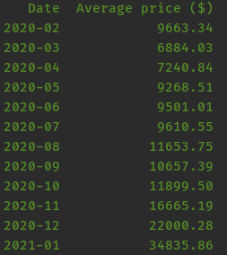
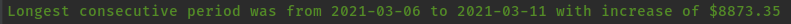
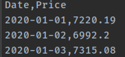
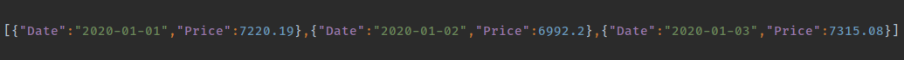

# Profile Software. Recruitment For Intern 03-2021.
## Mariusz Rogawski

---

### General info

The written script processes downloaded historical data from an external cryptocurrency API (bitcoin by default), which are made available
at [api.coinpaprika.com](https://api.coinpaprika.com/). 
Based on the downloaded information, the script allows you to perform such operations as:
* Calculates the average price of a currency for a given month over a given period
* Finds the longest consecutive period in which price was increasing
* Exports data for given period in one of selected format csv or json

The API returns data over a maximum period of one year.

After cloning the project on your computer and entering the project folder in the terminal, please enter the command:

    $ pip install -r requirements.txt 

to install all the necessary libraries for the script to run properly
or activate a virtual environment:

    on Linux $ source venv/bin/activate

    on Windows venv/Scripts/activate

To run a script, open a command line window in the folder with the script.py file
The above operations are performed in accordance with the commands described below.

---

### Calculates the average price of a currency for a given month over a given period.

In order to display the average cryptocurrency prices in given months in a given period, type in the command line:

    $ python script.py average-price-by-month --start-date=2020-02 --end-date=2021-01

The result of the given command is a list of months with the average values of the USD currency for the bitcoin cryptocurrency.

An optional parameter for performing operations on other cryptocurrencies is the parameter:

    --coin=other_cryptocurrency

Where in __other_cryptocurrency__ place another valid cryptocurrency name should be provided, for example:

    
    $ python script.py average-price-by-month --start-date=2020-02 --end-date=2021-01 --coin=usdt-tether

__The --coin parameter applies to all available operations__

---

### Finds the longest consecutive period in which price was increasing.

In order to display the longest consecutive period in which the cryptocurrency price has been increasing in the given period, in the command line window, enter:
    
    $ python script.py consecutive-increase --start-date=2021-03-01 --end-date=2021-04-01

The result of the command is a period of continuous increase in the price of the cryptocurrency and the value by which the price increased throughout the period
, default for bitcoin cryptocurrency.

---

###  Exports data for given period in one of selected format csv or json

In order to export data to a file in csv or json format in the specified period, enter in the command line window:

    $ python script.py export --start-date=2020-01-01 --end-date=2020-01-03 --format=csv --file=file.csv

or

    $ python script.py export --start-date=2020-01-01 --end-date=2020-01-03 --format=json --file=file.json

The result of the given commands is the creation of csv and json files with the dates and prices of the cryptocurrency for the given time interval, by default for the bitcoin cryptocurrency.

The open csv file is shown in the picture below.

The open json file is shown in the picture below.

